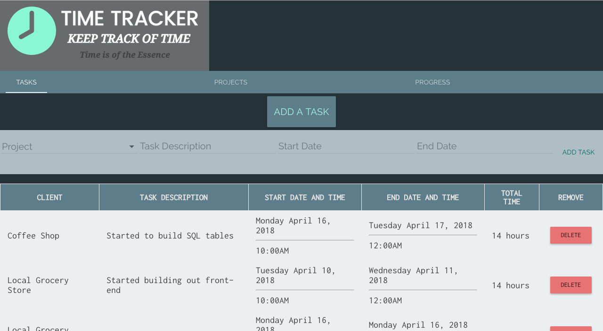
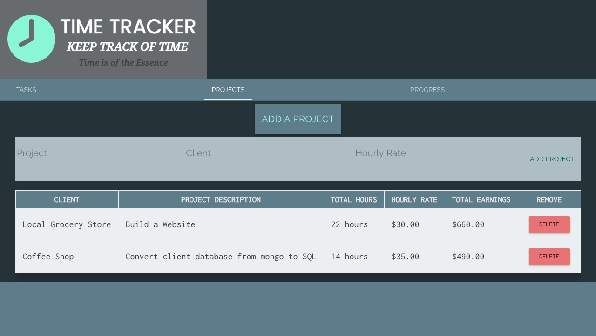
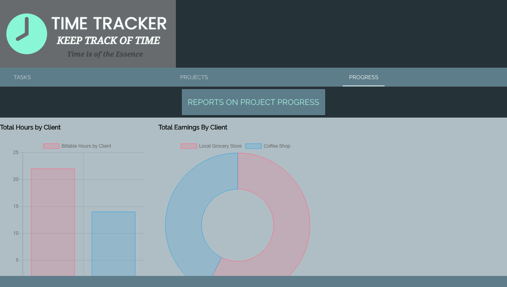

# Time Tracker App for AngularJS capstone project.

This app was intended as a prototype for independent-workers or anybody who works
for themselves. The premise is that they can add clients and the projects that they are working on for them with an hourly rate per project. For every project added, they have the ability to document all of their hours per each project for every client. 
The main features are that they can add a description of the task for the project, a start date and time along with an end date and time and the app will calculate the difference between the two and give you total hours for that task.
Then back on the projects page, for every hour added up from the tasks, the project table will then reflect how many total hours have been worked on for every project and then it will tell you the total earnings by calculating the total hours by the hourly rate.
Then as a fun feature, there is a report page that has two graphs.
One graph to visually represent how many hours worked for each client, and the other table visually represents the pay from each client.

## Tasks for Projects page

User can add tasks that they have completed for a client's project with start and end times.

## Client Project Page

User can add a client, project for client, and hourly rate for the project.

## Progress Charts

User can see all of their hours worked and how much they made per project in graph form.

### Tech Used
* AngularJS
* AngularJS Material Design
* ChartJS
* Sweetalert.js
* Google Fonts
* Node.js
* Express.js
* PostgreSQL
